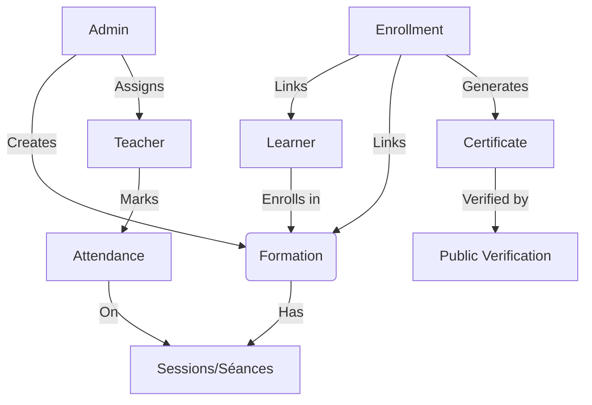
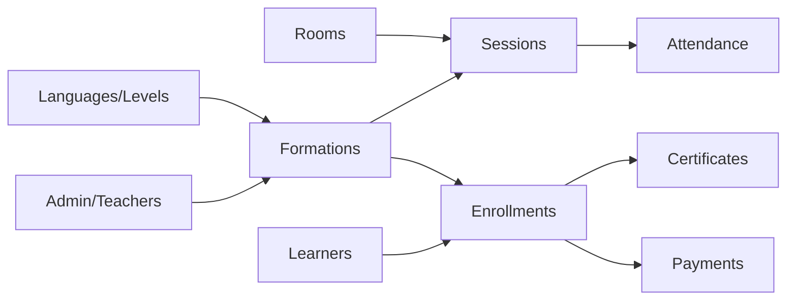

# CEIL Academic Seed Summary

This document provides a comprehensive overview of the data populated by the academic seed scripts (`npm run db:seed`). The seeding process initializes the database with a robust set of academic data, including languages, levels, users, formations, sessions, and enrollments.

## 🔑 Credentials Quick-Reference

Use these credentials to test different roles in the system. All accounts use the shared password: **`Password123`**.

| Role | Primary Identifier (Email/Matricule) | Password | Account Context |
| :--- | :--- | :--- | :--- |
| **Admin** | `admin@email.com` | `Password123` | Full dashboard access |
| **Teacher** | `teacher.01@email.com` | `Password123` | Assigned to multiple formations |
| **External Learner** | `student.01@email.com` | `Password123` | Enrolled in "CEIL Academic Formation 01" |
| **Internal Student** | Matricule: `INT-CEIL-2023-001` Bac Year: `2023` | `Password123` | UBMA internal student type |

> [!NOTE]
> There are **11 teachers** (`teacher.01@email.com` to `teacher.10@email.com` + `teacher@email.com`) and **21 learners** available for testing.

---

## 📊 Data Flow & Relations

The following charts visualize how entities are connected within the CEIL system.

### 1. Enrollment & Certificate Lifecycle
This flow shows the journey from a Formation creation to Certificate issuance.

### 2. Academic Infrastructure Dependencies
Seeding follows a strict phase-based pipeline to satisfy foreign key constraints.

---

## 📈 Entity Statistics

| Entity | Count | Description |
| :--- | :--- | :--- |
| **Languages** | 5 | EN, FR, ES, DE, IT |
| **Formation Levels** | 30 | 6 levels (A1-C2) per language |
| **Formations** | 20 | Main academic block (01-20) |
| **Sessions (Séances)** | 85 | ~4 sessions per formation |
| **Enrollments** | 21 | 1:1 mapping between academic learners and formations |
| **Certificates** | 20 | Generated for active main academic enrollments |
| **Feedback Rows** | 20 | Simulated student feedback |
| **Rooms** | 6 | SALLE-01..03, LAB-01, SALLE-PETITE, SALLE-MAINT |

---

## 🧪 Demo Scenarios Included

The seed includes specific scenarios to test edge cases:
- **Same-Day Density**: 10 back-to-back sessions on a single day for `teacher.01@email.com` to test overlap validation.
- **Closed Sales**: "CEIL Academic Demo — Inscriptions fermées" tests UI behavior for non-joinable formations.
- **Cancelled Cohorts**: "CEIL Academic Demo — Cohort annulée" for testing cancellation flows.
- **Room Availability**: "CEIL Academic Demo — Calendrier salle hebdo" provides overlapping sessions to verify room availability logic.

---

## 🛠️ Maintenance Commands

| Action | Command |
| :--- | :--- |
| **Full Reset** | `npm run db:reset` |
| **Apply Schema** | `npm run db:migrate` |
| **Main Seed** | `npm run db:seed` |
| **Extra Feedback** | `npm run db:seed:tracking-feedback` |
| **Dense Overlap Demo** | `npm run db:seed:same-day` |
