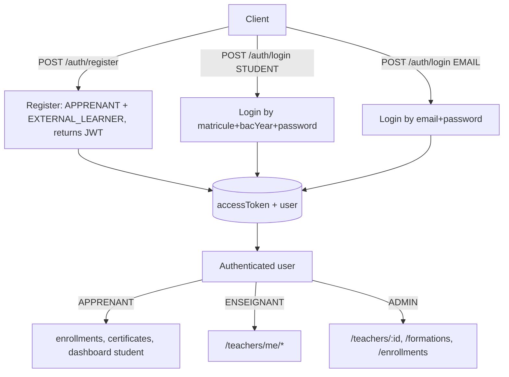

# Client Integration Spec — Apprenant + External Learners

Use this document in Cursor on the frontend (or share with the client team).

---

## 1) High-Level Changes

| Area | Old | New |
|------|-----|-----|
| Roles | `ADMIN`, `ENSEIGNANT`, `ETUDIANT` | `ADMIN`, `ENSEIGNANT`, **`APPRENANT`** |
| Account types | n/a | **`INTERNAL_STUDENT`**, **`EXTERNAL_LEARNER`** |
| Login | matricule + bacYear only | `loginType: STUDENT \| EMAIL` |
| Registration | none | `POST /auth/register` (returns `{ accessToken, user }`) |
| User fields | matricule + bacYear NOT NULL | matricule + bacYear **nullable**; new `email`, `dob`, `accountType`, `updatedAt` |
| Enrollment FK | `student_id` (DB) | `user_id` (DB) — JSON key still `student` |
| Frontend role guard | `role === "ETUDIANT"` | `role === "APPRENANT"` |

### Breaking changes for the frontend

- `POST /auth/login` body now requires `loginType`.
- JWT `role` is `APPRENANT` (not `ETUDIANT`).
- `user.matricule` and `user.bacYear` may be `null`.
- **External learners** (`accountType: EXTERNAL_LEARNER`) are identified by **email only**. They never have a matricule — do not generate placeholder matricules in the UI; use `user.email` (and `dob` if shown) instead.

---

## 2) Dataflow



---

## 3) Shared TypeScript Types (paste into client)

```ts
// roles & account types
export type UserRole = "ADMIN" | "ENSEIGNANT" | "APPRENANT";

export type AccountType = "INTERNAL_STUDENT" | "EXTERNAL_LEARNER";

// safe user shape returned by API (no password)
export interface AuthUser {
  id: string;
  firstName: string;
  lastName: string;
  email: string | null;
  matricule: string | null;
  bacYear: number | null;
  dob: string | null;            // ISO date "YYYY-MM-DD"
  role: UserRole;
  accountType: AccountType;
  createdAt: string;
  updatedAt: string;
}

// JWT payload (decoded)
export interface JwtPayload {
  sub: string;
  role: UserRole;
  iat: number;
  exp: number;
}

// generic auth response (login + register)
export interface AuthResponse {
  accessToken: string;
  user: Pick<AuthUser, "id" | "firstName" | "lastName" | "role"> & {
    accountType?: AccountType;
    email?: string | null;
  };
}
```

---

## 4) Auth Endpoints

### `POST /auth/register` (NEW, public)

Request:

```ts
interface RegisterDto {
  firstName: string;
  lastName: string;
  email: string;       // will be lowercased server-side
  password: string;    // min 6
  dob: string;         // ISO date "YYYY-MM-DD"
}
```

Response `201`:

```ts
type RegisterResponse = AuthResponse; // { accessToken, user }
```

Errors:

- `409 Conflict` — email already registered
- `400 Bad Request` — invalid payload

Behaviour:

- Creates user with `role: APPRENANT`, `accountType: EXTERNAL_LEARNER`, `matricule: null`, `bacYear: null`.
- Returns JWT immediately — no extra login call needed.

---

### `POST /auth/login` (CHANGED — discriminated union)

Request — student login:

```ts
interface StudentLoginDto {
  loginType: "STUDENT";
  matricule: string;
  bacYear: number;
  password: string;
}
```

Request — email login:

```ts
interface EmailLoginDto {
  loginType: "EMAIL";
  email: string;
  password: string;
}

type LoginDto = StudentLoginDto | EmailLoginDto;
```

Response `200`:

```ts
type LoginResponse = AuthResponse; // { accessToken, user }
```

Errors:

- `401 Unauthorized` — invalid credentials
- `400 Bad Request` — missing required fields for the chosen `loginType`

---

## 5) Endpoints That Changed Role Gates

All previously `ETUDIANT`-gated routes now require **`APPRENANT`** (no other contract change):

| Method | Path | Old gate | New gate |
|--------|------|----------|----------|
| POST | `/enrollments` | ETUDIANT | APPRENANT |
| GET | `/enrollments/me` | ETUDIANT | APPRENANT |
| GET | `/certificates/me` | ETUDIANT | APPRENANT |
| GET | `/dashboard/student` | ETUDIANT | APPRENANT |

Both `INTERNAL_STUDENT` and `EXTERNAL_LEARNER` users have role `APPRENANT`, so both can call these.

---

## 6) Endpoints With Updated User Payloads

These endpoints already existed but now return users with the new fields and nullable matricule/bacYear:

- `GET /enrollments/me` — `student.email`, `student.dob`, `student.accountType` may appear; `matricule`/`bacYear` may be `null` for external learners.
- `GET /enrollments/formation/:formationId` — same.
- `GET /teachers/me/formations/:formationId/enrollments` — same.
- `GET /certificates/me` — verification still by code, but `student` block can now have null matricule.
- `GET /public/certificates/:verificationCode` — `studentMatricule` field can now be `null`.

> Internal DB column was renamed `student_id → user_id`, but **the JSON key stays `student`** to avoid breaking the UI.

---

## 7) Client-Side Updates Checklist

### Auth module / API client

- Update `LoginDto` / `LoginRequest` to a discriminated union with `loginType: "STUDENT" | "EMAIL"`.
- Existing student login form → wrap submit body as:

  ```ts
  { loginType: "STUDENT", matricule, bacYear, password }
  ```

- New email login form → submit:

  ```ts
  { loginType: "EMAIL", email, password }
  ```

- Add `register()` API function calling `POST /auth/register`.
- Persist `accessToken` from `register` response the same way as login.

### Role guards / utilities

- Replace every `role === "ETUDIANT"` with `role === "APPRENANT"`.
- Remove the `ETUDIANT` constant from any frontend role enum.
- Add an `AccountType` enum and helper:

  ```ts
  export const isInternalStudent = (u: AuthUser) =>
    u.accountType === "INTERNAL_STUDENT";
  export const isExternalLearner = (u: AuthUser) =>
    u.accountType === "EXTERNAL_LEARNER";
  ```

### User profile UI

- Show `matricule` + `bacYear` only if present (internal students).
- Show `email` + `dob` for external learners.
- Display name uses `firstName` + `lastName` regardless.

### Forms

- Login screen: add a tab/toggle “Student / External” mapping to `loginType`.
- New Register screen: `firstName`, `lastName`, `email`, `password`, `dob` (date picker → ISO date string).
- After successful register: store token + redirect to dashboard (no second login call).

### Error handling

- 409 from `/auth/register` → show "Email already registered".
- 401 from `/auth/login` → show "Invalid credentials" (avoid leaking which mode failed).
- 400 → surface field validation errors as usual.

---

## 8) Field Reference for UI

**APPRENANT user — INTERNAL_STUDENT**

```json
{
  "id": "uuid",
  "firstName": "Mohamed",
  "lastName": "Benali",
  "email": null,
  "matricule": "20202345",
  "bacYear": 2020,
  "dob": null,
  "role": "APPRENANT",
  "accountType": "INTERNAL_STUDENT",
  "createdAt": "...",
  "updatedAt": "..."
}
```

**APPRENANT user — EXTERNAL_LEARNER**

```json
{
  "id": "uuid",
  "firstName": "Jane",
  "lastName": "Doe",
  "email": "jane@example.com",
  "matricule": null,
  "bacYear": null,
  "dob": "1995-04-12",
  "role": "APPRENANT",
  "accountType": "EXTERNAL_LEARNER",
  "createdAt": "...",
  "updatedAt": "..."
}
```

---

## 9) Cursor Prompt (paste in client repo Cursor)

```text
Update the client to support the new APPRENANT + external learner contract.

1. Replace UserRole "ETUDIANT" with "APPRENANT" everywhere (types, role guards, UI labels). Remove ETUDIANT.

2. Add a new type:
   type AccountType = "INTERNAL_STUDENT" | "EXTERNAL_LEARNER";
   Update AuthUser to include: email | null, dob | null, accountType, updatedAt; make matricule and bacYear nullable.

3. Auth API client:
   - Change LoginDto to a discriminated union:
     { loginType: "STUDENT", matricule, bacYear, password }
     | { loginType: "EMAIL", email, password }
   - Existing student login form must now send loginType: "STUDENT".
   - Add an email login form that sends loginType: "EMAIL".
   - Add register(payload): POST /auth/register with { firstName, lastName, email, password, dob }.
   - Register response is { accessToken, user } — same as login. After register, store token and redirect to dashboard.

4. UI:
   - Show matricule + bacYear if user.accountType === "INTERNAL_STUDENT".
   - Show email + dob if user.accountType === "EXTERNAL_LEARNER".
   - Defensive null checks for matricule/bacYear in any list/table.

5. Role-gated routes still work:
   - role === "APPRENANT" can access /enrollments/me, /certificates/me, /dashboard/student.

6. Errors:
   - 409 on register => "Email already registered".
   - 401 on login => "Invalid credentials" (do not leak which mode failed).

7. Do NOT change the JSON key "student" used in enrollment / teacher / certificate responses; it still represents the enrolled learner.

Deliverables:
- Updated types
- Updated API client
- Updated login + new register screens
- Updated role checks
- Brief migration note: ETUDIANT removed
```

---

## 10) API Base Path Reminder

If the frontend uses a global prefix, align with the backend (e.g. `/api/v1`).

---

*Generated for UBMA CEIL — backend contract: Apprenant + external learners.*
