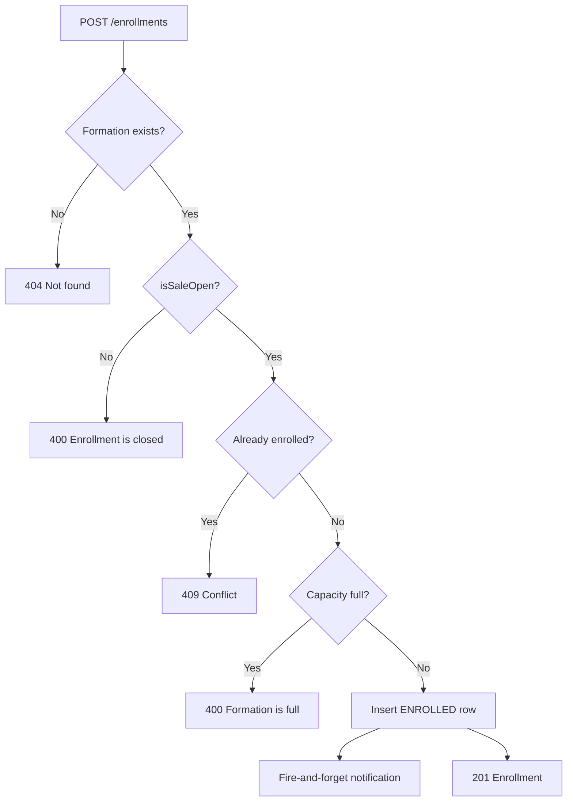

# Enrollments (Inscriptions) API

Reference documentation for the `enrollments` module — covering the **inscriptions** page (admin), the student "my enrollments" page, the teacher view, and the enrollment creation flow.

---

## 1. Overview

An **enrollment** (FR: *inscription*) is a row in the `enrollments` table that links a learner (`users.role = APPRENANT`) to a formation. Enrollments are created when a learner self-enrolls in an open formation. There is no PENDING/APPROVAL step in the current flow — enrollments are **created in `ENROLLED` status immediately**.

The module provides:

- Self-service enrollment (learner)
- Personal enrollment list (learner)
- Admin global list with filters
- Admin per-formation list
- Teacher list scoped to assigned formations

---

## 2. Auth & Role Matrix

All endpoints require a `Bearer` JWT.

| Method | Path | Role |
|--------|------|------|
| `POST` | `/enrollments` | `APPRENANT` |
| `GET` | `/enrollments/me` | `APPRENANT` |
| `GET` | `/enrollments` | `ADMIN` |
| `GET` | `/enrollments/formation/:formationId` | `ADMIN` |
| `GET` | `/enrollments/teacher` | `ENSEIGNANT` |

Any other role returns **`403 Forbidden`**.

---

## 3. Domain Model

### Enrollment status enum

```ts
type EnrollmentStatus = "ENROLLED" | "CANCELLED";
```

> The current schema does **not** have a `PENDING` status. Self-enrollment in an open formation is final and immediate. A future migration can add `PENDING` for an approval step — see **Business Logic** below.

### Core entity (`enrollments` table)

```ts
type Enrollment = {
  id: string;                  // uuid
  studentId: string;           // FK -> users.id (APPRENANT)
  formationId: string;         // FK -> formations.id
  status: EnrollmentStatus;    // default 'ENROLLED'
  enrolledAt: string;          // ISO 8601
};
```

### Unique constraint

`(studentId, formationId)` is unique — a learner cannot enroll twice in the same formation. Attempting to do so returns `409 Conflict`.

### Cascade behavior

- Deleting a learner cascades and removes their enrollments.
- Deleting a formation cascades and removes its enrollments.
- Deleting an enrollment cascades and removes its certificate (if any).

---

## 4. Endpoints

### 4.1 `POST /enrollments` — Self-enroll (APPRENANT)

**Body:**

```ts
type CreateEnrollmentDto = {
  formationId: string; // uuid, required
};
```

**Response `201`:**

Returns the created enrollment row.

```ts
type EnrollmentResponse = {
  id: string;
  studentId: string;
  formationId: string;
  status: "ENROLLED";
  enrolledAt: string;
};
```

**Errors:**

| Code | Reason |
|------|--------|
| `400` | `Enrollment is closed for this formation` (`isSaleOpen = false`) |
| `400` | `Formation is full` (capacity reached) |
| `400` | `startDate must be before endDate` (validation error from formation) |
| `404` | `Formation not found` |
| `409` | `Already enrolled in this formation` |

**Side effects:**

- Triggers a **fire-and-forget** notification email (admin + assigned teacher if available).
- Notifications use the learner's `firstName`, `lastName`, and `matricule` (or `(external learner — no matricule)` for external learners).

---

### 4.2 `GET /enrollments/me` — My enrollments (APPRENANT)

**Query params:** `FindEnrollmentsQueryDto` (see section 5).

**Response `200`:**

Paginated list of the calling user's enrollments, ordered by `enrolledAt DESC`.

```ts
type MyEnrollmentsResponse = PaginatedResponse<Enrollment>;
```

> The response items are raw enrollment rows. To display the formation title client-side, either follow up with `GET /formations/:id` or call `GET /enrollments/me` from the dashboard endpoint, which already joins formations.

---

### 4.3 `GET /enrollments` — Admin global list (ADMIN)

The **Inscriptions** admin page calls this endpoint.

**Query params:** `FindEnrollmentsQueryDto` (see section 5) — supports `status`, `formationId`, `search`, `page`, `limit`, `sortBy`, `sortOrder`.

**Response `200`:**

```ts
type AdminEnrollmentsResponse = PaginatedResponse<Enrollment>;
```

Items currently expose only `id`, `studentId`, `formationId`, `status`, `enrolledAt`. To render student and formation columns the frontend should either:

- Hydrate via `/users/:id` and `/formations/:id` per row (not ideal), or
- Use the dashboard endpoints that pre-join (e.g. `GET /dashboard/admin` → `recentEnrollments` includes `student.{firstName,lastName}` and `formation.{title}`).

> See section 8 for a recommended enrichment if a richer admin list is needed.

---

### 4.4 `GET /enrollments/formation/:formationId` — Admin per-formation (ADMIN)

**Path params:** `formationId: uuid`.

**Query params:** `FindEnrollmentsQueryDto`.

**Response `200`:** `PaginatedResponse<Enrollment>` filtered to the given `formationId`.

**Errors:**

- `404` if the formation does not exist.

---

### 4.5 `GET /enrollments/teacher` — Teacher list (ENSEIGNANT)

Returns enrollments across all formations the calling teacher is assigned to (via `formation_teachers`).

**Query params:** `FindEnrollmentsQueryDto`. Supports `search` against formation title and enrollment status.

**Response `200`:**

```ts
type TeacherEnrollmentsResponse = PaginatedResponse<{
  id: string;
  studentId: string;
  formationId: string;
  status: EnrollmentStatus;
  enrolledAt: string;
}>;
```

---

## 5. Shared Query DTO — `FindEnrollmentsQueryDto`

```ts
type FindEnrollmentsQueryDto = {
  // PaginationQueryDto
  page?: number;          // default 1, min 1
  limit?: number;         // default 10, min 1, max 100
  search?: string;        // ilike against enrollments.status (and formations.title for teacher route)
  sortBy?: "enrolledAt" | "status";  // default "enrolledAt"
  sortOrder?: "asc" | "desc";        // default "desc"

  // Enrollment-specific
  status?: "ENROLLED" | "CANCELLED";
  formationId?: string;   // uuid
};
```

Validation: `page`/`limit` are coerced to integers; out-of-range or non-uuid filters return `400`.

---

## 6. Pagination Envelope

All paginated endpoints share this envelope:

```ts
type PaginatedResponse<T> = {
  data: T[];
  meta: {
    page: number;
    limit: number;
    total: number;
    totalPages: number;
    hasNextPage: boolean;
    hasPreviousPage: boolean;
  };
};
```

---

## 7. Business Logic

### 7.1 Enroll flow (priority order)



### 7.2 Capacity check

- `formations.capacity = NULL` → unlimited capacity (no cap enforced).
- Otherwise, `count(enrollments WHERE status='ENROLLED') >= capacity` blocks new enrollments.
- `CANCELLED` enrollments do **not** count against capacity, so re-enrollment after cancel could exceed history but never current capacity.

### 7.3 Status semantics

| Status | Meaning |
|--------|---------|
| `ENROLLED` | Learner is currently enrolled — counted toward capacity, eligible for certificate after `formation.endDate < now` |
| `CANCELLED` | Enrollment is voided — not counted, not eligible for certificate |

> No endpoint currently exposes a "cancel" mutation. Cancellation is handled administratively (manual update). Add a dedicated route if/when self-cancel is needed.

### 7.4 Notifications

- Sent **after** a successful insert.
- Non-blocking: the API responds with `201` even if email fails. Errors are logged in `NotificationsService`.
- Recipients: the platform admin email + the formation's main teacher (when one is assigned and has an email on file).
- External learners (no matricule) appear with `Matricule: (external learner — no matricule)` in the email body.

### 7.5 Roles & ownership

- A learner can only see **their own** enrollments via `/enrollments/me`.
- A teacher can only see enrollments for **formations they are assigned to** via `/enrollments/teacher`.
- An admin can see all enrollments.
- The route guards rely on `@Auth(UserRole.X)` + `RolesGuard`, so role mismatch returns `403` before the service runs.

### 7.6 Future: PENDING validation step

The schema enum is `("ENROLLED", "CANCELLED")`. To support an approval workflow:

1. Migrate the DB enum to `("PENDING", "ENROLLED", "CANCELLED")`.
2. Default new self-enrollments to `PENDING`.
3. Add `PATCH /enrollments/:id/approve` (ADMIN) and `/cancel`.
4. Update capacity check to include `PENDING` if reservations are exclusive.
5. Update `getPendingEnrollmentsCount()` in `dashboard.repository.ts` to return the real count (currently returns `0`).

---

## 8. Frontend Integration Notes (Inscriptions Page)

### Recommended call pattern

| Section | Endpoint | Auth |
|---------|----------|------|
| Stats cards | `GET /dashboard/admin/stats` (`certificatesToGenerate`, `activeStudents`) | ADMIN |
| Inscriptions table | `GET /enrollments` with filters | ADMIN |
| Per-formation drilldown | `GET /enrollments/formation/:formationId` | ADMIN |
| Recent enrollments widget | `GET /dashboard/admin` → `recentEnrollments` (already joined) | ADMIN |

### Filters typically rendered

- `status`: `ENROLLED` / `CANCELLED` toggle
- `formationId`: dropdown
- `search`: free-text (currently matches enrollment status)
- `sortBy`: `enrolledAt` (default) | `status`

### Known limitations & recommendations

1. **`GET /enrollments` returns raw rows**, not joined with student or formation. The frontend must either:
   - Call additional endpoints to hydrate (N+1 risk), or
   - **Recommended:** request a backend enrichment to include `student` (firstName, lastName, email, matricule, accountType) and `formation` (id, title) in the list response — same pattern used in `dashboard.repository.getRecentEnrollments()`.
2. The `search` filter on admin list **currently matches `enrollments.status` text**, which is rarely useful. A future enrichment should switch to matching student name / formation title.
3. There is no **CSV export** endpoint — the page should paginate or call repeatedly with a high `limit` (max 100).
4. Cancellation must currently be performed at DB level — no API exposes it yet.

### Display tips per row

- **Student**: prefer `firstName lastName` + `matricule` for internal students, fallback to `email` for external learners (`accountType === "EXTERNAL_LEARNER"`).
- **Formation**: title + language code + level code if available.
- **Status badge**: green for `ENROLLED`, neutral for `CANCELLED`.
- **Date**: format `enrolledAt` in user's locale.

---

## 9. Example Payloads

### `POST /enrollments`

Request:

```json
{ "formationId": "c1a2b3c4-0000-0000-0000-000000000001" }
```

Response `201`:

```json
{
  "id": "e1d2c3b4-0000-0000-0000-000000000099",
  "studentId": "00000000-0000-0000-0000-0000000000aa",
  "formationId": "c1a2b3c4-0000-0000-0000-000000000001",
  "status": "ENROLLED",
  "enrolledAt": "2026-05-01T08:30:00.000Z"
}
```

### `GET /enrollments?page=1&limit=10&status=ENROLLED`

Response `200`:

```json
{
  "data": [
    {
      "id": "e1d2c3b4-...",
      "studentId": "00000000-...",
      "formationId": "c1a2b3c4-...",
      "status": "ENROLLED",
      "enrolledAt": "2026-05-01T08:30:00.000Z"
    }
  ],
  "meta": {
    "page": 1,
    "limit": 10,
    "total": 42,
    "totalPages": 5,
    "hasNextPage": true,
    "hasPreviousPage": false
  }
}
```

### `GET /enrollments/me`

Same shape as admin list — items scoped to the calling learner.

### `GET /enrollments/teacher?search=Anglais`

Response items add no extra fields but rows are filtered to formations the teacher is assigned to.

---

## 10. Error Reference

| Code | When |
|------|------|
| `400 Bad Request` | Validation failure on body/query, formation closed/full |
| `401 Unauthorized` | Missing or invalid JWT |
| `403 Forbidden` | Wrong role for the endpoint |
| `404 Not Found` | `formationId` does not exist |
| `409 Conflict` | Duplicate **ENROLLED** enrollment for `(studentId, formationId)` |

---

## 11. Formation price and enrollment data consistency

- **`POST /enrollments`** returns **`formation`** as a full **formation card** (same semantics as formations list): `price` (string \| null from numeric), `capacity`, `enrolledCount` (ENROLLED only), `spotsRemaining`, `isSaleOpen`, dates ISO, normalized `language` / `level`.
- **`GET /enrollments`**, **`GET /enrollments/formation/:formationId`**, **`GET /enrollments/me`**, and **`GET /enrollments/teacher`** embed **`student`** and/or **`formation`** with that card shape where applicable; `enrolledAt` is ISO **string** on the wire.
- **Business messages (FR):** sale closed, formation full, duplicate enroll, and blocked re-enrollment after **CANCELLED** are returned as **400** / **409** with explicit bodies (see implementation).
- **Re-enrollment:** a **CANCELLED** row still occupies the unique `(studentId, formationId)` key; the API returns **400** until a future migration or reactivation flow allows a new ENROLLED row.

---

*Generated for UBMA CEIL — enrollments (inscriptions) backend contract.*
